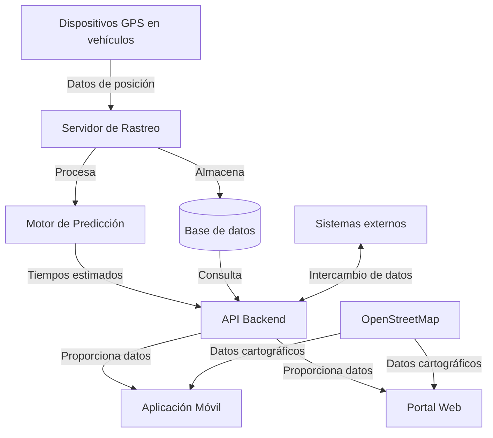

# Arquitectura del Sistema

## Diagrama General

El Sistema de Rastreo en Tiempo Real para Transporte Público está construido con una arquitectura robusta y escalable que permite manejar un gran volumen de datos en tiempo real.

## Componentes Principales

### Capa de Recolección de Datos

- **Dispositivos GPS**: Instalados en cada vehículo de la flota, transmiten su ubicación en intervalos regulares
- **Servidor de Rastreo**: Recibe, valida y procesa los datos de ubicación de todos los vehículos

### Capa de Procesamiento

- **Base de Datos**: Almacena históricos de posiciones, rutas, horarios programados y datos de usuarios
- **Motor de Predicción**: Algoritmo que calcula los tiempos estimados de llegada basándose en datos históricos y condiciones actuales

### Capa de Presentación

- **API Backend**: Proporciona endpoints RESTful para acceder a todos los datos del sistema
- **Aplicación Móvil**: Interfaz principal para los usuarios finales
- **Portal Web**: Acceso alternativo y panel de administración

## Flujo de Datos

1. Los dispositivos GPS envían datos de posición cada 5 segundos
2. El servidor de rastreo recibe estos datos y los almacena en la base de datos
3. El motor de predicción procesa las posiciones actuales junto con datos históricos para calcular predicciones
4. La API expone los datos procesados
5. Las aplicaciones cliente (móvil y web) consultan la API para mostrar la información al usuario final

En las siguientes secciones exploraremos con más detalle cada uno de estos componentes y sus tecnologías.
